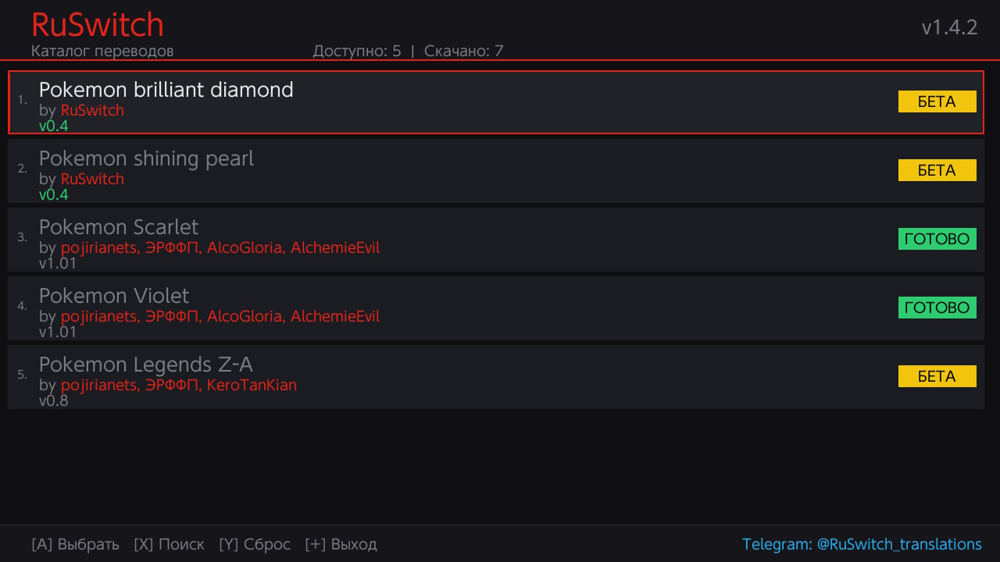
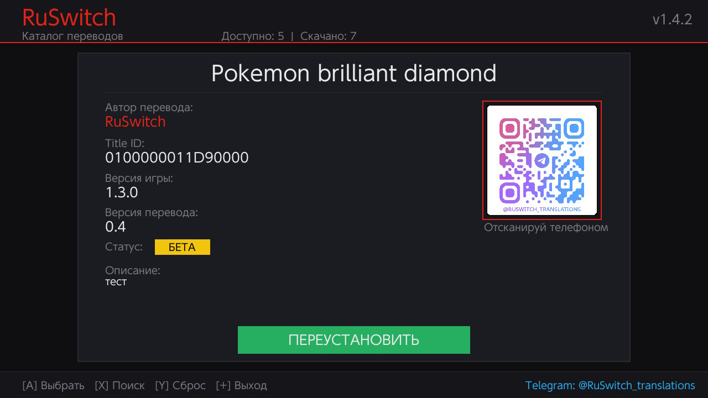

RuSwitch
========

Версия: 1.4.2

Платформа: Nintendo Switch

RuSwitch — homebrew-приложение для Nintendo Switch с каталогом русификаторов игр.
Скачивайте и устанавливайте переводы прямо с консоли!

Скриншоты
-----------

Возможности
-----------

- Каталог русификаторов — все доступные переводы в одном месте
- Умный поиск — быстрый поиск игр по названию
- Установка в один клик — скачивание и распаковка автоматически
- Автообновление русификаторов — уведомления о новых версиях
- Автообновление приложения — через GitHub Releases
- QR-коды авторов — связь с переводчиками через соцсети
- Современный GUI — тёмная тема, анимации, скруглённые углы
- Статистика — отслеживание скачиваний

Установка
---------

Требования:
- Nintendo Switch с установленным CFW (Atmosphere)
- Homebrew Launcher (hbmenu)
- Подключение к интернету

Шаги:
1. Скачайте последний релиз: https://github.com/Kvinkxerli/RuSwitch/releases/latest
2. Скопируйте файл на SD-карту: sdmc:/switch/RuSwitch_App.nro
3. Запустите через Homebrew Menu

Использование
-------------

Навигация:
- Стик/Крестовина — перемещение по списку
- A — выбрать игру / установить русификатор
- B — назад
- X — поиск
- Y — сброс поиска / переустановка
- + — выход

Установка русификатора:
1. Выберите игру из списка
2. Нажмите A на экране деталей
3. Дождитесь скачивания и распаковки
4. Перезагрузите консоль для применения

Обновление приложения:
При наличии новой версии приложение автоматически:
1. Покажет экран "Скачивание обновления..."
2. Скачает новый .nro файл
3. Предложит перезапустить приложение

Changelog
---------

v1.4.2:
- Обновлён GUI — единая стилистика, скруглённые углы
- Исправлена работа автообновления через GitHub Releases
- Добавлена поддержка QR-кодов с соцсетями авторов
- Добавлена кнопка "Переустановить" для установленных русификаторов
- Увеличены лимиты отображения текста
- Исправлены наложения элементов интерфейса

Контакты
--------

- Telegram: @RuSwitch_translations
- Сайт: https://ruswitch.kvink.space

Благодарности
-------------

- devkitPro — инструменты разработки
- SDL2 — графическая библиотека
- libcurl — HTTP-клиент
- Всем авторам русификаторов за их работу!

Сделано с любовью для сообщества Nintendo Switch.
